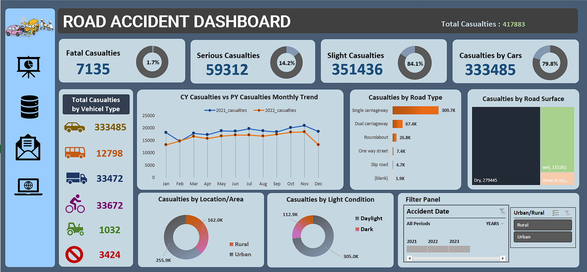

# Accident Analysis Dashboard
[](https://www.microsoft.com/en-us/microsoft-365/excel)
[](https://www.google.com/sheets)

## Overview

This repository contains data related to road accidents for the years 2021 and 2022. The dataset comprises over 3 million entries with more than 8 columns, including a primary key. The primary focus is on key performance indicators (KPIs) related to accident casualties.

## Dashboard

I've created a comprehensive dashboard using Excel, leveraging the power of pivot tables for in-depth analysis. The dashboard provides a visual representation of crucial accident-related metrics.

## Data Analysis Steps

### 1. Data Collection

- Collected road accident data for the years 2021 and 2022.

### 2. Data Cleaning

- Corrected text inconsistencies.
- Checked and removed duplicates.
- Added new columns with additional measurements.

### 3. Dashboard Creation

- Utilized pivot tables for comprehensive data analysis.
- Focused on key performance indicators related to accident casualties.

## Showcase

### Dashboard Preview



### Dashboard in Action

[](https://youtu.be/xxEgZ6vAKvk)

Click on the image above to view the dashboard in action.

## Usage

1. Clone the repository:

   ```bash
   git clone https://github.com/sagarv2522/accident-analysis-dashboard.git
